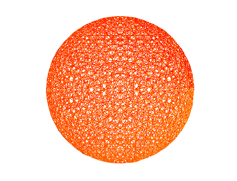

<!--
	@author: Olga Baitemirova
	First Year ULB project 
-->
# Graphical representation of multiplication tables

*"Mathematics, rightly viewed, possesses not only truth, but supreme beauty—a beauty cold and
austere, like that of sculpture, without appeal to any part of our weaker nature, without the gor-
geous trappings of painting or music, yet sublimely pure, and capable of a stern perfection such as
only the greatest art can show." B. Russell*

# Tools
- Python
- Turtle Graphics

## How to run this program ?
In command line: 
> $ python3 graphical_mult.py <k> <n> <r> <r1> <g1> <b1> <r2> <g2> <b2>

where: 
k: the multiplication table 
n: the modulo 
r: the radius 
r1: the red component of the first color 
g1: the green component of the first color 
b1: the blue component of the first color 
r2: the red component of the second color 
g2: the green component of the second color 
b2: the blue component of the second color 
 
For exemple: 
> $ python3 graphical_mult.py 55 500 150 250 1 1 254 130 1

#

#### Overview

